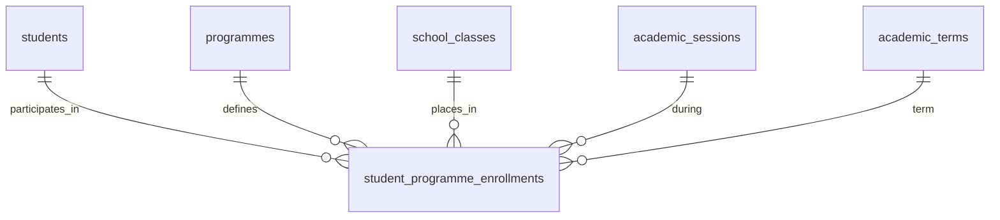
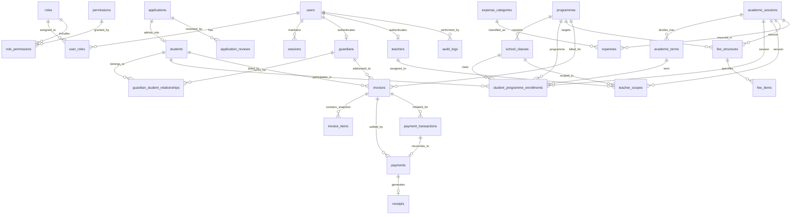

# Swanford Academy: Database Architecture Design Review (Stage 2A — Final Revision)

**Document Reference:** `docs/DATABASE_ARCHITECTURE_DESIGN.md`  
**Status:** Stage 2A Final Architecture Specification (Design Only — Awaiting Sign-off)  
**Primary Reference:** `Swanford_Academy_Master_Project_Specification.docx`  
**Target Engine:** PostgreSQL 16+ via Prisma ORM  
**Target Deployment:** Hostinger Linux VPS (KVM1: 1 vCPU, 4GB RAM) with local/staging parity

---

## 1. Executive Summary

This specification establishes the authoritative relational database architecture for **Swanford Academy** (Nursery, Primary, and Tahfeez School in Dutse, Jigawa State).

The system is designed for multi-year stability, non-repudiable auditability, multi-child parent support, flexible simultaneous programme participation, and financial precision.

### Core Architectural Mandates
1. **PostgreSQL as Single Source of Truth:** All identity, academic progression, financial balances, and admissions records live authoritatively in PostgreSQL.
2. **Decoupled Identity & Access (Role ≠ Permission ≠ Scope):** User roles establish persona; permissions grant atomic capabilities; scopes delineate operational boundaries (e.g., specific classes for teachers, specific children for parents).
3. **Simultaneous Multi-Programme Architecture:** A student can participate in multiple programmes concurrently (e.g., Primary 4 as main academic placement, plus Tahfeez as an additional programme) without duplicating student records and with independent fee structures.
4. **Verified Parent Multi-Child Hierarchy:** One parent account can link to multiple children across different classes and programmes. Existing verified parents are reused upon subsequent sibling admissions, subject to email verification and conflict detection.
5. **Permanent Academic History:** Class placement and programme participation are snapshot-modeled per academic session and term. Advancing a student does not overwrite past records.
6. **Immutable Financial Ledger:** Invoices snapshot line items at issuance. Historical invoices are never altered when future fee structures change.
7. **Gateway Decoupling & Idempotency:** School payment records (ledger credits) are strictly separated from external Paystack transaction logs and webhook events.
8. **Integer Kobo Precision & Safe Serialization:** All currency amounts are stored in integer Kobo (`BigInt` / `Integer`). A dedicated serialization contract prevents JavaScript `BigInt` JSON runtime crashes.

---

## 2. Database Principles

| Principle | Architectural Requirement | Database Implementation |
|---|---|---|
| **Single Truth** | No derived counters or cached totals stored as authoritative state. | Dashboards calculate sums dynamically from underlying records. |
| **Identity Decoupling** | Students do not have user credentials in V1; staff and parents have user credentials. | `users` table holds authentication; domain tables (`guardians`, `teachers`, `students`) hold domain profiles. |
| **No Record Duplication** | Never duplicate student or parent profiles to handle multiple programmes or multiple children. | Explicit junction entities: `student_programme_enrollments` and `guardian_student_relationships`. |
| **Snapshot Invariants** | Historical academic placements and financial obligations must never mutate. | `student_programme_enrollments` tracks historical terms; `invoice_items` freezes descriptive text and unit prices at billing time. |
| **Destructive Delete Prohibition** | Financial, academic, and identity records must never be deleted casually. | `ON DELETE RESTRICT` on all core foreign keys. Soft lifecycle states (`GRADUATED`, `CANCELLED`, `VOIDED`, `SUSPENDED`). |
| **Gateway Idempotency** | Duplicate payment webhook events from Paystack must never duplicate school credits. | Unique constraint on `payment_webhook_events(gateway_provider, event_id)`. |
| **Zero Production Fake Data** | Production starts completely pristine. | Seeds split into foundational system constants and test mocks. |

---

## 3. Domain & Entity Inventory

The database is structured into **8 logical domains** comprising **27 core entities**:

```
[ Domain 1: Identity, RBAC & Security Persistence ]
  1. users
  2. roles
  3. permissions
  4. role_permissions
  5. user_roles
  6. sessions
  7. password_resets

[ Domain 2: People & Relationships ]
  8. guardians
  9. teachers
  10. students
  11. guardian_student_relationships
  12. teacher_scopes

[ Domain 3: Academic Structure & Multi-Programme Enrollment ]
  13. academic_sessions
  14. academic_terms
  15. programmes
  16. school_classes
  17. subjects
  18. student_programme_enrollments  <-- [CRITICAL: Supports simultaneous programmes]

[ Domain 4: Admissions Lifecycle ]
  19. applications
  20. application_reviews

[ Domain 5: Invoicing & School Ledger ]
  21. fee_structures
  22. fee_items
  23. invoices
  24. invoice_items
  25. payments
  26. receipts

[ Domain 6: Payment Gateway Integration ]
  27. payment_transactions
  28. payment_webhook_events

[ Domain 7: Expenses & Operations ]
  29. expense_categories
  30. expenses

[ Domain 8: Audit, Notifications & System Config ]
  31. audit_logs
  32. notifications
  33. system_configs
```

---

## 4. Entity-by-Entity Explanation

### Domain 1: Identity, RBAC & Security Persistence

#### 1. `users`
* **Purpose:** Authentication credential and account status record for system users.
* **Fields:** `id` (UUID), `email` (unique, lowercase), `phone_number` (unique, nullable), `password_hash` (string), `status` (`ACTIVE`, `PENDING_VERIFICATION`, `SUSPENDED`, `DEACTIVATED`), `email_verified_at` (timestamp), `failed_login_attempts` (integer), `locked_until` (timestamp), `created_at`, `updated_at`.
* **Note:** Students have no `users` record in V1 (no student portal).

#### 2. `roles`
* **Purpose:** High-level administrative/user classifications (`SUPER_ADMIN`, `ADMIN`, `ACCOUNTANT`, `TEACHER`, `PARENT`).
* **Fields:** `id` (UUID), `code` (unique string), `name` (string), `description` (string), `is_system` (boolean).

#### 3. `permissions`
* **Purpose:** Atomic functional actions enforced server-side.
* **Fields:** `id` (UUID), `code` (unique string e.g. `invoice:create`, `invoice:cancel`, `attendance:record`, `admission:approve`, `report:generate`).

#### 4. `role_permissions`
* **Purpose:** Many-to-many junction between `roles` and `permissions`.
* **Composite Key:** `(role_id, permission_id)`.

#### 5. `user_roles`
* **Purpose:** Assigns one or more roles to a user.
* **Composite Key:** `(user_id, role_id)`.

#### 6. `sessions`
* **Purpose:** Server-side persisted session state for HTTP-only cookie sessions.
* **Fields:** `id` (UUID), `user_id` (FK), `session_token_hash` (unique), `ip_address` (string), `user_agent` (string), `expires_at` (timestamp), `created_at` (timestamp).

#### 7. `password_resets`
* **Purpose:** Cryptographically secure, single-use password recovery tokens.
* **Fields:** `id` (UUID), `user_id` (FK), `token_hash` (unique), `expires_at` (timestamp), `used_at` (timestamp, nullable).

---

### Domain 2: People & Relationships

#### 8. `guardians`
* **Purpose:** Profile of a parent or legal guardian.
* **Fields:** `id` (UUID), `user_id` (FK to `users`, unique, nullable until parent portal activation), `title` (string), `first_name` (string), `last_name` (string), `other_names` (string, nullable), `email` (string), `phone_primary` (string), `phone_secondary` (string, nullable), `residential_address` (string), `occupation` (string, nullable), `is_verified` (boolean), `created_at`, `updated_at`.

#### 9. `teachers`
* **Purpose:** Profile of an academic teaching staff member.
* **Fields:** `id` (UUID), `user_id` (FK to `users`, unique), `staff_id_number` (unique string e.g. `STAFF-2026-001`), `first_name` (string), `last_name` (string), `qualification` (string), `status` (`ACTIVE`, `ON_LEAVE`, `TERMINATED`), `created_at`, `updated_at`.

#### 10. `students`
* **Purpose:** Master student identity record. Permanent across all years and programmes.
* **Fields:** `id` (UUID), `admission_number` (unique string: `SA-YYYY-NNNN`), `first_name` (string), `last_name` (string), `other_names` (string, nullable), `gender` (`MALE`, `FEMALE`), `date_of_birth` (date), `blood_group` (string, nullable), `genotype` (string, nullable), `medical_notes` (text, nullable), `admission_date` (date), `current_status` (`ACTIVE`, `GRADUATED`, `TRANSFERRED_OUT`, `WITHDRAWN`, `SUSPENDED`), `created_at`, `updated_at`.
* **Critical Design:** Contains **NO** permanent `programme_id` or `class_id`. Placements are managed dynamically via `student_programme_enrollments`.

#### 11. `guardian_student_relationships`
* **Purpose:** Explicit junction linking guardians to students.
* **Fields:** `id` (UUID), `guardian_id` (FK), `student_id` (FK), `relationship_type` (`FATHER`, `MOTHER`, `LEGAL_GUARDIAN`, `SPONSOR`), `is_primary_contact` (boolean), `can_pickup` (boolean), `receives_invoices` (boolean), `status` (`ACTIVE`, `REVOKED`), `created_at`, `updated_at`.
* **Constraints:** Unique `(guardian_id, student_id)`. Partial unique index ensuring at most one `is_primary_contact = true` per student.

#### 12. `teacher_scopes`
* **Purpose:** Operational boundary restricting teacher access to assigned classes and subjects.
* **Fields:** `id` (UUID), `teacher_id` (FK), `academic_session_id` (FK), `school_class_id` (FK), `subject_id` (FK, nullable if class teacher for all subjects), `is_form_teacher` (boolean).
* **Constraints:** Unique `(teacher_id, academic_session_id, school_class_id, subject_id)`.

---

### Domain 3: Academic Structure & Multi-Programme Enrollment

#### 13. `academic_sessions`
* **Purpose:** Annual academic school year (e.g. `2025/2026`, `2026/2027`).
* **Fields:** `id` (UUID), `name` (unique string), `start_date` (date), `end_date` (date), `is_current` (boolean).
* **Constraint:** Unique partial index on `is_current = true`.

#### 14. `academic_terms`
* **Purpose:** Trimester division within a session (`FIRST`, `SECOND`, `THIRD`).
* **Fields:** `id` (UUID), `academic_session_id` (FK), `term_code` (`FIRST`, `SECOND`, `THIRD`), `name` (string), `start_date` (date), `end_date` (date), `is_current` (boolean).
* **Constraint:** Unique `(academic_session_id, term_code)`.

#### 15. `programmes`
* **Purpose:** High-level school curricular divisions: Creche, Pre-Nursery, Nursery, Primary, Tahfeez.
* **Fields:** `id` (UUID), `code` (unique: `CRECHE`, `PRE_SCHOLARS`, `PRE_NURSERY`, `NURSERY`, `PRIMARY`, `TAHFEEZ`), `name` (string), `is_main_academic` (boolean: true for Nursery/Primary, false for standalone/co-curricular like Tahfeez), `description` (string), `display_order` (integer).

#### 16. `school_classes`
* **Purpose:** Concrete instructional class cohorts (e.g. Nursery 1, Primary 4, Tahfeez Class A).
* **Fields:** `id` (UUID), `programme_id` (FK), `code` (unique string: `NUR_1`, `PRI_4`, `TAH_A`), `name` (string), `arm` (string, nullable), `capacity` (integer).

#### 17. `subjects`
* **Purpose:** Subjects taught within a programme/class.
* **Fields:** `id` (UUID), `programme_id` (FK), `code` (unique string), `name` (string).

#### 18. `student_programme_enrollments` *(CRITICAL MULTI-PROGRAMME ENTITY)*
* **Purpose:** Tracks student placement in a programme and class for a specific academic session and term. Supports simultaneous enrollments.
* **Fields:** `id` (UUID), `student_id` (FK), `programme_id` (FK), `school_class_id` (FK), `academic_session_id` (FK), `academic_term_id` (FK), `enrollment_type` (`MAIN_ACADEMIC`, `ADDITIONAL_PROGRAMME`), `enrollment_status` (`ACTIVE`, `COMPLETED`, `WITHDRAWN`), `created_at`, `updated_at`.
* **Constraints:**
  * Unique composite `(student_id, programme_id, academic_session_id, academic_term_id)` — A student cannot be enrolled in the same programme twice in the same term.
  * Partial unique index: Exactly one row with `enrollment_type = 'MAIN_ACADEMIC'` per `(student_id, academic_session_id, academic_term_id)`.

---

### Domain 4: Admissions Lifecycle

#### 19. `applications`
* **Purpose:** Public admission application for a prospective student.
* **Fields:** `id` (UUID), `application_number` (unique string: `APP-YYYY-NNNN`), `academic_session_id` (FK), `target_main_programme_id` (FK), `target_class_id` (FK), `enroll_in_tahfeez` (boolean, default false), `applicant_first_name` (string), `applicant_last_name` (string), `applicant_other_names` (string, nullable), `applicant_gender` (`MALE`, `FEMALE`), `applicant_dob` (date), `guardian_first_name` (string), `guardian_last_name` (string), `guardian_email` (string), `guardian_phone` (string), `guardian_relationship` (`FATHER`, `MOTHER`, `LEGAL_GUARDIAN`), `existing_guardian_id` (FK, nullable), `application_fee_kobo` (integer, default 500000 = ₦5,000), `application_fee_status` (`UNPAID`, `PAID`, `WAIVED`), `email_verified` (boolean), `status` (`DRAFT`, `SUBMITTED`, `UNDER_REVIEW`, `CONFLICT_REVIEW`, `APPROVED`, `REJECTED`, `ENROLLED`), `created_at`, `updated_at`.

#### 20. `application_reviews`
* **Purpose:** Administrative audit of admission evaluation and decisions.
* **Fields:** `id` (UUID), `application_id` (FK), `reviewer_id` (FK to `users`), `decision` (`APPROVED`, `REJECTED`, `CHANGES_REQUESTED`), `notes` (text), `reviewed_at` (timestamp).

---

### Domain 5: Invoicing & School Ledger

#### 21. `fee_structures`
* **Purpose:** Configurable fee templates per session, term, programme, class, gender, and admission status.
* **Fields:** `id` (UUID), `academic_session_id` (FK), `academic_term_id` (FK), `programme_id` (FK), `school_class_id` (FK, nullable for all classes in programme), `applicable_gender` (`ALL`, `MALE`, `FEMALE`), `is_admission_fee` (boolean), `name` (string), `is_active` (boolean).

#### 22. `fee_items`
* **Purpose:** Component line items within a fee structure (Tuition, Books, Uniform, Cardigan, Medical, Exam).
* **Fields:** `id` (UUID), `fee_structure_id` (FK), `name` (string), `amount_kobo` (BigInt/integer Kobo).

#### 23. `invoices`
* **Purpose:** Official bill issued to a student/guardian.
* **Fields:** `id` (UUID), `invoice_number` (unique string: `INV-YYYY-NNNNN`), `student_id` (FK), `guardian_id` (FK), `academic_session_id` (FK), `academic_term_id` (FK), `programme_id` (FK, indicates the programme being billed e.g. Primary or Tahfeez), `fee_structure_id` (FK, nullable), `total_amount_kobo` (BigInt/integer Kobo), `amount_paid_kobo` (BigInt/integer Kobo, default 0), `outstanding_balance_kobo` (BigInt/integer Kobo), `status` (`ISSUED`, `PARTIALLY_PAID`, `PAID`, `CANCELLED`, `REFUNDED`), `due_date` (date), `issued_at` (timestamp), `created_at`, `updated_at`.

#### 24. `invoice_items`
* **Purpose:** Frozen line item snapshot created at invoice issuance.
* **Fields:** `id` (UUID), `invoice_id` (FK), `description` (string), `unit_amount_kobo` (BigInt/integer Kobo), `quantity` (integer, default 1), `total_amount_kobo` (BigInt/integer Kobo).
* **Guarantees:** Completely decoupled from future `fee_items` mutations.

#### 25. `payments`
* **Purpose:** Official school ledger credit entry.
* **Fields:** `id` (UUID), `payment_reference` (unique string: `PAY-YYYY-NNNNN`), `invoice_id` (FK), `student_id` (FK), `payer_guardian_id` (FK, nullable), `amount_kobo` (BigInt/integer Kobo), `payment_method` (`PAYSTACK`, `BANK_TRANSFER`, `CASH`, `POS`), `status` (`CONFIRMED`, `PENDING_VERIFICATION`, `REVERSED`), `notes` (string, nullable), `recorded_by_user_id` (FK to `users`), `paid_at` (timestamp), `created_at`.

#### 26. `receipts`
* **Purpose:** Official receipt document generated for each confirmed payment.
* **Fields:** `id` (UUID), `receipt_number` (unique string: `REC-YYYY-NNNNN`), `payment_id` (FK, unique), `invoice_id` (FK), `issued_to_name` (string), `amount_kobo` (BigInt/integer Kobo), `issued_at` (timestamp).

---

### Domain 6: Payment Gateway Integration (Paystack)

#### 27. `payment_transactions`
* **Purpose:** Lifecycle tracking of external Paystack gateway transactions.
* **Fields:** `id` (UUID), `gateway_provider` (`PAYSTACK`), `gateway_reference` (unique string), `gateway_transaction_id` (string, nullable), `invoice_id` (FK, nullable), `application_id` (FK, nullable), `amount_kobo` (BigInt/integer Kobo), `gateway_fee_kobo` (BigInt/integer Kobo, nullable), `status` (`INITIALIZED`, `PENDING`, `SUCCESS`, `FAILED`, `ABANDONED`), `channel` (string, nullable), `paid_at` (timestamp, nullable), `gateway_response_json` (JSONB, nullable), `school_payment_id` (FK to `payments`, unique, nullable until verified).

#### 28. `payment_webhook_events`
* **Purpose:** Inbound webhook audit log and deduplication barrier.
* **Fields:** `id` (UUID), `gateway_provider` (`PAYSTACK`), `event_id` (unique string), `event_type` (string e.g. `charge.success`), `payload_json` (JSONB), `signature_verified` (boolean), `processed` (boolean), `processed_at` (timestamp, nullable), `error_message` (text, nullable), `created_at`.
* **Constraint:** Unique `(gateway_provider, event_id)`.

---

### Domain 7: Expenses & Operations

#### 29. `expense_categories`
* **Purpose:** Chart of expense accounts (Salaries, Stationery, Maintenance, Utilities).
* **Fields:** `id` (UUID), `code` (unique string), `name` (string), `description` (string, nullable), `is_active` (boolean).

#### 30. `expenses`
* **Purpose:** Operational expenditure ledger recorded by the Accountant.
* **Fields:** `id` (UUID), `expense_number` (unique string: `EXP-YYYY-NNNNN`), `category_id` (FK), `academic_session_id` (FK), `academic_term_id` (FK, nullable), `title` (string), `description` (text), `amount_kobo` (BigInt/integer Kobo), `payment_method` (`BANK_TRANSFER`, `CASH`, `CHEQUE`), `payee_name` (string), `receipt_voucher_url` (string, nullable), `recorded_by_user_id` (FK to `users`), `expense_date` (date), `status` (`RECORDED`, `VOIDED`), `created_at`.

---

### Domain 8: Audit, Notifications & System Config

#### 31. `audit_logs`
* **Purpose:** Non-repudiable audit trail of sensitive administrative and financial actions.
* **Fields:** `id` (UUID), `user_id` (FK to `users`, nullable if system action), `action` (string), `entity_type` (string), `entity_id` (string), `old_values` (JSONB, nullable), `new_values` (JSONB, nullable), `ip_address` (string), `user_agent` (string), `created_at` (timestamp).
* **Rule:** Append-only. No updates or deletes.

#### 32. `notifications`
* **Purpose:** Outbound message delivery status log.
* **Fields:** `id` (UUID), `recipient_user_id` (FK, nullable), `recipient_email` (string, nullable), `recipient_phone` (string, nullable), `channel` (`EMAIL`, `SMS`, `WHATSAPP`), `template_name` (string), `subject` (string), `body_text` (text), `status` (`PENDING`, `SENT`, `DELIVERED`, `FAILED`), `provider_message_id` (string, nullable), `error_message` (text, nullable), `sent_at` (timestamp, nullable), `created_at`.

#### 33. `system_configs`
* **Purpose:** Typed operational settings for normal school management.
* **Fields:** `id` (UUID), `key` (unique string), `value` (string / JSON string), `category` (`GENERAL`, `FINANCE`, `ADMISSIONS`, `ACADEMICS`), `description` (string, nullable), `created_at`, `updated_at`.

---

## 5. Parent / Guardian Architecture & Existing Parent Matching (D1)

```
[ New Admission Application Arrives ]
               │
               ▼
[ Check guardian_email against guardians.email ]
               │
       ┌───────┴───────────────────────┐
       ▼                               ▼
[ No Match Found ]             [ Verified Email Match Found ]
       │                               │
       │                               ▼
       │               [ Compare Name & Phone Numbers ]
       │                               │
       │                     ┌─────────┴─────────┐
       │                     ▼                   ▼
       │             [ Data Consistent ]  [ Data Conflicting ]
       │                     │                   │
       │                     ▼                   ▼
       │             [ Set existing_    [ Set status =      ]
       │               guardian_id ]    [ 'CONFLICT_REVIEW' ]
       │                     │          [ Flag for Admin    ]
       │                     │                   │
       ▼                     ▼                   ▼
[ Standard Review ]   [ Approve Application ]   [ Super Admin Review: ]
                      [ Link child to       ]   [ A: Link Existing    ]
                      [ existing guardian   ]   [ B: Update Guardian  ]
                      [ No duplicate parent ]   [ C: Create Separate  ]
```

### Approved Rules for D1
1. **No Blind Automatic Merging:** An identical email never merges records automatically without verification.
2. **Stable Internal IDs:** `guardians.id` (UUID) is the definitive identifier, never names or phone numbers.
3. **Multi-Child Relationship Junction:**
   * One parent entity links to multiple student entities via `guardian_student_relationships`.
   * When Parent Muhammad has Ahmed, Aisha, and Fatima at Swanford, Muhammad has **one** `users` record, **one** `guardians` record, and **three** rows in `guardian_student_relationships`.
4. **Multiple Guardians per Child:**
   * Both Father and Mother can maintain independent parent portal accounts linked to the same children.
   * `is_primary_contact` designates who receives urgent communications and primary billing notifications.

---

## 6. Critical Multi-Programme Architecture

A student at Swanford Academy can participate in **multiple programmes concurrently** (e.g., Primary 4 + Tahfeez, or Nursery 2 + Tahfeez).

### The Solution: `student_programme_enrollments`



### Architectural Distinctions: Main Academic Placement vs. Additional Programme
* **`programmes.is_main_academic` (Boolean):**
  * `TRUE` for Creche, Pre-Scholars, Pre-Nursery, Nursery, and Primary.
  * `FALSE` for Tahfeez (standalone/co-curricular).
* **`student_programme_enrollments.enrollment_type`:**
  * `MAIN_ACADEMIC`: The student's core curricular grade level. Exactly one active `MAIN_ACADEMIC` record per student per session/term.
  * `ADDITIONAL_PROGRAMME`: Concurrent participation in programmes like Tahfeez. Zero or more per student per session/term.

### Concrete Example
Ahmed Sani in Academic Session 2026/2027 (First Term):
1. **Row 1:** `(student_id = Ahmed, programme_id = PRIMARY, class_id = PRI_4, session = 2026/2027, term = FIRST, enrollment_type = 'MAIN_ACADEMIC')`
2. **Row 2:** `(student_id = Ahmed, programme_id = TAHFEEZ, class_id = TAH_A, session = 2026/2027, term = FIRST, enrollment_type = 'ADDITIONAL_PROGRAMME')`

*Ahmed Sani has exactly ONE record in `students`, but TWO active programme enrollment records.*

---

## 7. Academic History Architecture

* **Historical Permanence:** Advancing Ahmed to Primary 5 in session 2027/2028 inserts a new row in `student_programme_enrollments` for session 2027/2028. The 2026/2027 records remain untouched.
* **Attendance & Assessments:** Future attendance and assessment records reference `student_programme_enrollment_id` or composite `(student_id, session_id, term_id, class_id)`.
  * Ahmed's Primary 4 attendance is tracked separately from his Tahfeez attendance.
  * Ahmed's Primary 4 report card queries his `MAIN_ACADEMIC` subjects.
* **Student Status Transitions:**
  * When a student leaves, `students.current_status` updates to `GRADUATED`, `TRANSFERRED_OUT`, or `WITHDRAWN`.
  * All past enrollment rows, past invoices, and past receipts remain historically queryable.

---

## 8. Admission Architecture & Student Number Generation (D2)

### Approved Rules for D2
* **Format:** `SA-YYYY-NNNN` (e.g. `SA-2026-0001`).
* **Invariants:**
  * `SA` = Swanford Academy prefix.
  * `YYYY` = Year of initial admission.
  * `NNNN` = Sequential zero-padded number per calendar year.
  * No programme codes embedded. If Ahmed starts in Nursery 1 and moves to Primary 6 and Tahfeez, his admission number remains `SA-2026-0001` for life.

### Application Lifecycle Flow
```
[DRAFT] -> [SUBMITTED] -> [PAYMENT_PENDING (₦5,000 Application Fee)]
                             │
                             ▼ (Paystack Success Callback / Webhook)
                        [UNDER_REVIEW] (Email Verified)
                             │
                             ├── If conflicts flagged -> [CONFLICT_REVIEW]
                             │
                             ├── If rejected -> [REJECTED] (Audited, notified)
                             │
                             └── If approved -> [APPROVED]
                                      │
                                      ▼
                        [ENROLLED: Atomic Transition]
                        1. Generate Student (SA-YYYY-NNNN)
                        2. Create Main Academic Enrollment
                        3. If enroll_in_tahfeez -> Create Tahfeez Enrollment
                        4. Link or Create Guardian (D1)
                        5. Issue Initial School-Fee Invoice (D3)
```

---

## 9. Fee & Invoicing Architecture (D3)

### Approved Rules for D3
1. **Approved Admission:** Generates the applicable first-term invoice immediately.
2. **Application Form Fee:** Separate standalone transaction (₦5,000) not tied to tuition invoices.
3. **Subsequent Terms:** Invoices generated via controlled Accountant batch actions per term.
4. **Idempotent Billing:** A unique constraint on `invoices(student_id, programme_id, academic_session_id, academic_term_id)` prevents accidental duplicate billing for the same period.
5. **Multiple Programme Fees:**
   * A student enrolled in Primary 4 + Tahfeez receives:
     * Primary 4 School Fee Invoice (`programme_id = PRIMARY`)
     * Tahfeez School Fee Invoice (`programme_id = TAHFEEZ`)
   * Or a single itemized invoice containing both programme lines. Having `programme_id` on the invoice allows either clean separation or combined presentation without hardcoding.

### Initial Configuration Values (Configured in Database, Not Hardcoded in Code)
* **Nursery First Term (Boys):** ₦102,000 (`10200000` Kobo)
* **Nursery First Term (Girls):** ₦107,500 (`10750000` Kobo)
* **Primary First Term (Boys):** ₦110,000 (`11000000` Kobo)
* **Primary First Term (Girls):** ₦115,500 (`11550000` Kobo)
* **Nursery 2nd & 3rd Term:** ₦49,000 (`4900000` Kobo)
* **Primary 2nd & 3rd Term:** ₦49,000 (`4900000` Kobo)
* **Tahfeez First Term:** ₦18,000 (`1800000` Kobo)
* **Tahfeez 2nd & 3rd Term:** ₦8,000 (`800000` Kobo)
* **Admission Form Fee:** ₦5,000 (`500000` Kobo)

---

## 10. Historical Financial Integrity & Snapshotting

```
[fee_structures] ────> [fee_items]
                             │
                             ▼ (At Invoice Issuance)
[invoices] ──────────> [invoice_items: FROZEN COPY]
  │                     - description: "Tuition Fee"
  │                     - unit_amount_kobo: 4900000
  │                     - quantity: 1
  │
  ▼ (Subsequent Payments)
[payments] ──────────> [receipts]
```

### Invariants
1. **Item Snapshotting:** `invoice_items` copies descriptive strings and unit amounts at issuance.
2. **Fee Schedule Updates:** When the school updates Nursery 2nd term fee from ₦49,000 to ₦55,000 for 2027/2028, past invoices for 2026/2027 remain strictly ₦49,000.
3. **No Financial Deletions:** Invoices and payments cannot be deleted. If issued erroneously, an invoice is updated to `CANCELLED` with audit notes.
4. **Direct Payment Allocation (D4):**
   * Payments attach directly to specific invoices.
   * `amount_paid_kobo` and `outstanding_balance_kobo` are updated atomically in the same database transaction.
   * Overpayment is prevented by checking `payment.amount_kobo <= invoice.outstanding_balance_kobo`.

---

## 11. Money Representation & Safe Serialization

### Database & Language Layers
1. **PostgreSQL Column:** `BIGINT` (stores whole Kobo).
2. **Prisma Type:** `BigInt`.
3. **Application Math:** Lossless integer arithmetic via [`src/lib/money.ts`](file:///c:/SWANFORD%20ACADEMY/src/lib/money.ts).

### Solving the JavaScript BigInt JSON Crash
JavaScript's `JSON.stringify()` throws `TypeError: Do not know how to serialize a BigInt` by default.

**Strict Serialization Standard:**
```typescript
// 1. In API route serialization and Server Action returns:
// All BigInt kobo values are serialized as Numbers (safe up to ₦90 trillion)
// or Strings before sending over JSON APIs.

export function serializeMoney(val: bigint | number): number {
  return typeof val === "bigint" ? Number(val) : val;
}

// 2. Global BigInt serialization patch in src/lib/prisma.ts:
if (typeof BigInt !== "undefined" && !("toJSON" in BigInt.prototype)) {
  Object.defineProperty(BigInt.prototype, "toJSON", {
    get() {
      return () => Number(this);
    },
  });
}
```
This guarantees no API or Next.js route ever crashes due to BigInt serialization.

---

## 12. Payment Gateway Architecture (Paystack)

```
[Parent clicks "Pay Online"]
            │
            ▼
[Insert payment_transactions (Status: INITIALIZED, gateway_reference: SWF_TX_...)]
            │
            ▼
[Paystack Checkout Modal / Redirect]
            │
            ▼
[Paystack Webhook: charge.success] ───> [Verify Signature: X-Paystack-Signature]
                                                    │
                                                    ▼
                                    [Insert payment_webhook_events]
                                    [Constraint: Unique(gateway_provider, event_id)]
                                    ├── If duplicate -> Exit (200 OK)
                                    └── If first time ->
                                             │
                                             ▼
                                    [Verify Transaction with Paystack API]
                                             │
                                             ▼
                                    [Atomic Database Transaction:]
                                    1. Update payment_transactions -> SUCCESS
                                    2. Insert payments -> CONFIRMED
                                    3. Update invoice:
                                       amount_paid += amount
                                       outstanding -= amount
                                       status = (outstanding == 0 ? PAID : PARTIALLY_PAID)
                                    4. Insert receipts
                                    5. Audit log & trigger receipt email
```

---

## 13. Expense Architecture

* **Categorization:** `expense_categories` groups operational costs (Salaries, Stationery, Facilities, Utilities, ICT).
* **Expenditure Ledger:** `expenses` records payee, amount in Kobo, payment method, date, and academic session/term.
* **Audit & Reporting:** Protected by `ON DELETE RESTRICT`. Voided expenses preserve the audit record with a reason note.

---

## 14. Audit Architecture

Every sensitive administrative, academic, or financial action writes an append-only row to `audit_logs`:

| Column | Type | Content |
|---|---|---|
| `id` | UUID | Primary Key |
| `user_id` | UUID (FK) | Actor performing the action (nullable for system webhooks) |
| `action` | String | e.g. `USER_ROLE_ASSIGNED`, `INVOICE_CANCELLED`, `PAYMENT_RECORDED`, `ADMISSION_APPROVED` |
| `entity_type`| String | e.g. `Invoice`, `Payment`, `Student`, `Application` |
| `entity_id` | String | Targeted entity UUID |
| `old_values` | JSONB | Pre-mutation state snapshot |
| `new_values` | JSONB | Post-mutation state snapshot |
| `ip_address` | String | Client IP address |
| `user_agent` | String | Client browser / device |
| `created_at` | Timestamp | Timestamp of execution |

---

## 15. Security & Session Persistence Architecture

* **Persistent Sessions:** `sessions` table tracks active session tokens. On user password reset or suspension, deleting or invalidating rows in `sessions` terminates all client devices immediately.
* **Brute-Force Lockout:** `users.failed_login_attempts` and `users.locked_until` persist across server restarts, preventing dictionary attacks.
* **Single-Use Password Tokens:** `password_resets` hashes tokens and tracks `used_at`, preventing token replay.

---

## 16. School Configuration Architecture

Distinguishes between **Core Business Records**, **System Configurations**, and **Secrets**:

1. **Core Business Records (Dedicated Relational Tables):**
   * Students, Guardians, Classes, Invoices, Payments, Expenses.
2. **Operational Configurations (`system_configs` Table):**
   * Key-value settings editable by Super Admin:
     * `school.name`
     * `school.motto`
     * `school.address`
     * `admissions.form_fee_kobo`
     * `finance.bank_name`
     * `finance.account_number`
     * `finance.account_name`
3. **Security Secrets (Environment Variables Only):**
   * Database credentials, session secrets, Paystack private keys. Never stored in PostgreSQL.

---

## 17. Primary Keys, Foreign Keys, Unique Constraints & Index Strategy

### Primary Keys
* Standard **UUID v4** (`id UUID DEFAULT gen_random_uuid() PRIMARY KEY`) across all tables.

### Crucial Unique Constraints
1. `users(lower(email))`
2. `students.admission_number` (`SA-YYYY-NNNN`)
3. `guardian_student_relationships(guardian_id, student_id)`
4. `student_programme_enrollments(student_id, programme_id, academic_session_id, academic_term_id)`
5. `applications.application_number` (`APP-YYYY-NNNN`)
6. `invoices.invoice_number` (`INV-YYYY-NNNNN`)
7. `invoices(student_id, programme_id, academic_session_id, academic_term_id)` (prevents duplicate term invoices)
8. `payments.payment_reference` (`PAY-YYYY-NNNNN`)
9. `receipts.receipt_number` (`REC-YYYY-NNNNN`)
10. `receipts.payment_id`
11. `payment_transactions.gateway_reference`
12. `payment_webhook_events(gateway_provider, event_id)`
13. `system_configs.key`

### Index Strategy (KVM1 VPS Resource Optimization)

```sql
-- Identity & Access
CREATE INDEX idx_users_email ON users(lower(email));
CREATE INDEX idx_sessions_token ON sessions(session_token_hash);
CREATE INDEX idx_sessions_user ON sessions(user_id, expires_at);

-- People & Relationships
CREATE INDEX idx_rel_student ON guardian_student_relationships(student_id);
CREATE INDEX idx_rel_guardian ON guardian_student_relationships(guardian_id);
CREATE INDEX idx_teacher_scopes ON teacher_scopes(teacher_id, academic_session_id, school_class_id);

-- Multi-Programme Academic History
CREATE INDEX idx_prog_enroll_student ON student_programme_enrollments(student_id, academic_session_id);
CREATE INDEX idx_prog_enroll_class ON student_programme_enrollments(school_class_id, academic_session_id, academic_term_id);
CREATE INDEX idx_prog_enroll_prog ON student_programme_enrollments(programme_id, academic_session_id);

-- Admissions
CREATE INDEX idx_applications_email ON applications(lower(guardian_email));
CREATE INDEX idx_applications_status ON applications(status, academic_session_id);

-- Ledger & Gateway
CREATE INDEX idx_invoices_student_status ON invoices(student_id, status);
CREATE INDEX idx_invoices_guardian ON invoices(guardian_id);
CREATE INDEX idx_invoices_session_term ON invoices(academic_session_id, academic_term_id);
CREATE INDEX idx_payments_invoice ON payments(invoice_id);
CREATE INDEX idx_payments_paid_at ON payments(paid_at);
CREATE INDEX idx_gateway_ref ON payment_transactions(gateway_reference);
CREATE INDEX idx_webhook_events ON payment_webhook_events(gateway_provider, event_id);

-- Expenses & Audit
CREATE INDEX idx_expenses_session ON expenses(academic_session_id, category_id);
CREATE INDEX idx_audit_entity ON audit_logs(entity_type, entity_id);
CREATE INDEX idx_audit_created ON audit_logs(created_at DESC);
```

---

## 18. Complete Database Entity-Relationship Diagram (ERD)



---

## 19. Seed Strategy: Production Zero-State vs. Development

* **Production Seed (`prisma/seed.prod.ts`):**
  * Seeds **ONLY** foundational system structure:
    * System Roles (`SUPER_ADMIN`, `ADMIN`, `ACCOUNTANT`, `TEACHER`, `PARENT`)
    * Core System Permissions
    * Curricular Programmes (Creche, Pre-Scholars, Pre-Nursery, Nursery, Primary, Tahfeez)
    * Default Classes & Subjects
    * First Academic Session & Terms
    * Baseline Configuration Keys (`system_configs`)
    * Initial Fee Structures (Section 9)
    * Exactly one initial Super Admin account (with forced password reset)
  * **Strict Production State at Launch:**
    * Students: 0
    * Teachers: 0 (apart from Super Admin)
    * Parents: 0
    * Applications: 0
    * Payments: ₦0
    * Expenses: ₦0
    * Revenue: ₦0
    * Outstanding: ₦0
* **Development Seed (`prisma/seed.dev.ts`):**
  * Seeds realistic local testing scenarios: multiple children linked to one parent, Primary 4 + Tahfeez multi-programme enrollments, sample invoices, partial payments, and teacher scopes.
  * Guarded by `if (process.env.NODE_ENV === "production") throw new Error("Forbidden in production");`.

---

## 20. Database Quality & Performance Considerations

1. **Scale Over Time:** With 5,000 students over 10 years, `student_programme_enrollments` will hold ~150,000 rows. The composite index `(student_id, academic_session_id)` and `(school_class_id, academic_session_id, academic_term_id)` ensures sub-millisecond query performance.
2. **KVM1 Resource Protection:** 
   * Connection pool capped at 10 connections per Next.js instance.
   * All list endpoints enforce mandatory cursor-based pagination.
   * JSON columns (`payload_json`, `old_values`, `new_values`) are indexed with GIN only if queried directly, keeping write overhead minimal.

---

## 21. Summary of Approved Design Decisions

* **D1 (Existing Parent Matching):** Verified email is the primary matching signal. Consistent data allows existing parent reuse; conflicting data triggers an Admin Review queue. Stable internal UUIDs are the true identity.
* **D2 (Admission Number):** Permanent, globally unique sequential format `SA-YYYY-NNNN` (e.g. `SA-2026-0001`). No programme abbreviations embedded.
* **D3 (Invoicing Flow):** Hybrid model. Admission approval generates first-term invoice. ₦5,000 application fee is a separate standalone event. Subsequent terms use idempotent batch billing by the Accountant.
* **D4 (Payment Allocation):** Payments attach directly to specific invoices. No parent wallet/balance-pool in V1.
* **Critical Multi-Programme Solution:** Multi-programme participation modeled explicitly via `student_programme_enrollments` distinguishing `MAIN_ACADEMIC` from `ADDITIONAL_PROGRAMME`.

---

## 22. Stage 2B Implementation Sequence (Proposed)

Upon your explicit approval:
1. **Schema Definition (`prisma/schema.prisma`):** Implement the 27 models with strict types, indexes, and referential constraints.
2. **Migration Generation:** Run `npx prisma migrate dev --name init_swanford_full_schema`.
3. **Seed Scripts:** Implement `prisma/seed.ts` with strict production zero-state enforcement.
4. **Verification Sequence:** Execute `prisma generate`, `typecheck`, `lint`, test runner, and live PostgreSQL smoke test.
5. **Report & Stop:** Present verification results and await Stage 3 instructions.
